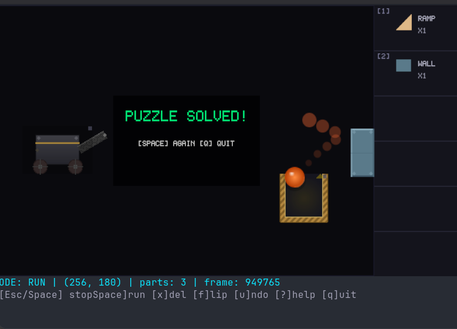

# TIM2 Terminal

The Incredible Machine 2, reimagined as a terminal game.

A physics-based puzzle game where you place parts to guide a cannonball into a basket — rendered either in full pixel fidelity (Kitty/Sixel) or as purpose-built Unicode art (ratatui), directly in your terminal.

## Screenshot



*Pixel renderer in Ghostty — cannon fires ball, bounces off wall, lands in basket.*

## Quick Start

```bash
cd mvp
cargo run --release              # auto-detect best renderer
cargo run --release -- --pixel   # force pixel renderer
cargo run --release -- --text    # force text renderer
```

## How to Play

Place parts on the playfield to redirect the cannonball from the cannon into the basket. Press Space to run the simulation and watch the chain reaction.

### Controls

| Key | Action |
|---|---|
| `h/j/k/l` | Move cursor (4px) |
| `H/J/K/L` | Move cursor fast (16px) |
| `p` | Place mode |
| `e` | Edit mode (part under cursor) |
| `Space` | Run simulation |
| `f` | Flip part |
| `x` | Delete part |
| `u` | Undo |
| `?` | Help overlay |
| `q` | Quit |

### Modes

- **NORMAL** — navigate cursor, manage parts
- **PLACE** — select from parts bin, position, confirm with Enter
- **EDIT** — move/flip/delete a placed part
- **RUN** — simulation running, Esc/Space to stop

## Terminal Compatibility

| Terminal | Renderer | Fidelity |
|---|---|---|
| kitty | Pixel | Full pixel, fastest |
| WezTerm | Pixel | Full pixel |
| Ghostty | Pixel | Full pixel |
| foot, xterm (+sixel) | Pixel | Full pixel |
| iTerm2 | Pixel | Full pixel |
| Alacritty | Text | Purpose-built Unicode |
| Windows Terminal | Text | Purpose-built Unicode |
| Any ANSI terminal | Text | Works everywhere |

The text renderer is **not a fallback** — it's a purpose-built rendering path using ratatui that looks good on its own terms. The game auto-detects the best renderer at startup, or you can override with `--pixel` / `--text`.

## Dual Renderer Architecture

```
              Game Logic + Physics
          (pixel coordinates, renderer-agnostic)
         /                              \
   Pixel Renderer                  Text Renderer
   image + viuer                   ratatui + Unicode
   640x360 RgbaImage               Terminal cells
   Kitty/Sixel/iTerm2              Any ANSI terminal
```

Both renderers implement a shared `Renderer` trait. Physics and game logic are completely decoupled from rendering — identical gameplay regardless of mode.

## Tech Stack

| Layer | Choice |
|---|---|
| Language | Rust |
| Terminal I/O | `crossterm 0.28` |
| Pixel renderer | `image 0.25` + `imageproc 0.25` + `viuer 0.11` |
| Text renderer | `ratatui 0.29` |
| Physics | Manual Euler integration |
| Game loop | Raw Rust, 60 fps cap |

## MVP Parts

| Part | Size | Pixel | Text |
|---|---|---|---|
| Ball | 28x28 | Anti-aliased sphere with specular highlight and trail | `●` with `·` trail |
| Ramp | 64x32 | Wood-grain triangle with gradient shading | `╱╲` with `░` fill |
| Wall | 64x32 | Beveled steel rectangle with corner rivets | `▛▀▜ ▙▄▟` blocks |
| Basket | 64x64 | Woven wicker U-shape with gold goal glow | `║╚═╝` with `▽` arrows |
| Cannon | 96x64 | Gunmetal body, barrel, spoked wheels, brass trim | Box-drawing with `═▸◯` |

## Project Structure

```
mvp/
  Cargo.toml
  src/
    main.rs           — entry point, CLI args, mode detection, game loop
    state.rs          — GameState, Part, PartKind, SimBall, Mode
    input.rs          — vim-style 4-mode input handling
    physics.rs        — Euler integration, collision resolution
    logging.rs        — file logger, crash dump with terminal env
    hud.rs            — HUD content generation
    puzzle.rs         — hardcoded MVP puzzle
    render/
      mod.rs          — Renderer trait
      pixel.rs        — PixelRenderer (viuer pipeline)
      pixel_gfx.rs    — drawing primitives, bitmap font
      text.rs         — TextRenderer (ratatui pipeline)
    parts/
      ball.rs         — ball rendering + trail
      ramp.rs         — ramp rendering + collision
      wall.rs         — wall rendering + collision
      basket.rs       — basket rendering + win detection
      cannon.rs       — cannon rendering + firing
```

## Logging

Logs are written to `mvp/logs/` with a `latest.log` symlink. On panic, a crash dump is written with full terminal environment info and backtrace.

```bash
cat mvp/logs/latest.log    # view last session
ls mvp/logs/crash_*.txt    # check for crash dumps
```

## What's Next

- Rapier2D physics (replacing manual Euler)
- More parts: rope, pulley, belt, gears
- Electrical system and laser system
- Animals (Pokey the Cat, Mort the Mouse)
- Puzzle loader/saver
- Level progression
- Workshop mode (level editor)
- Head-to-head mode

## Docs

- [MVP Specification](docs/MVP_SPEC.md) — dual engine architecture, part visuals, rendering pipeline
- [Game Engine Stack](docs/GAME_ENGINE.md) — technology decisions and POC results
- [TIM2 Game Feature Spec](docs/TIM2_GAME_SPEC.md) — complete original game reference
